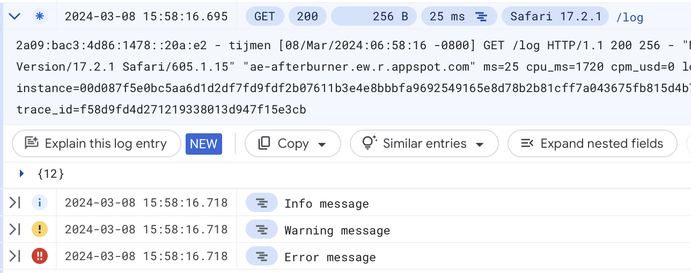

# App Engine Afterburner

When App Engine was first created as serverless platform-as-a-service, the
original vision was *zero-configuration*, where everything would just work out
the box and only a single app engine SDK was needed. This SDK is then used to
build your app, and App Engine took care of the rest. Networking, logging, error
reporting, memcache and tracing, all these things worked out of the box with
*no setup required*. This made App Engine highly appealing back in the days.

Sadly, this vision has been lost over the years, replaced by something called "Open Cloud".
The effect has been that each and every user now needs to cobble together multiple
libraries to get basic functionality (such as logging) to work, and still end up
with worse performance and/or less features because of the lowest common
denominator effects these "run everywhere" solutions tend to have.

As a result, the "2nd-gen" App Engine runtime experience is a lot worse
in key areas. Recommend client libraries for other GCP services tend to have a
ton of complicated dependencies (cloud-logging), are slow (cloud-bigquery), or
require ridiculous amounts of boilerplate (open-telemetry).

This library, Afterburner, tries to remedy these issues by providing a single
small library with **no dependencies**, except the App Engine bundled services
SDK, to bring the App Engine 2nd gen experience as close as possible to what
it was a decade ago! The focus is getting things working out the box, and
providing simple clients to GCP services.


## Cloud Logging

In original App Engine, all lines logged during a request are contained in
the same log entry as the result itself, which is exactly what you want. The
2nd-gen runtimes does not do this, and instead each log line is logged
separately, resulting in a jumbled mess of messages as a result.

To correlate logs back with the requests they originate from, the Google Cloud Trace header
must be associated with each log entry, and then in the log viewer, a user
must select the "correlate by" drop-down menu and choose
"App Engine request log".

How do you get these trace headers? Google recommends the `google-cloud-logging` library to setup logs for App
Engine to do this, but it has *many* heavy weight dependencies (including
GRPC). It also does not play nice with AppEngine testbed because of the GRPC
threads that are spawned. I didn't want to waste any more time investigating
these problems and instead removed the library.

Luckily there is an alternative, and that is to use [structured logging](https://cloud.google.com/logging/docs/structured-logging).
The App Engine 2nd gen runtimes automatically send contents of stdout/stderr
to the logging service (without any additional api calls in your request
handler needed!). By formatting the contents in a specific way, we can get
correlation working in the request logs:



These also work correct in Cloud Trace:


Afterburner has a `StructuredLoggingMiddleware` class that wraps your main
application and intercepts all logs made during a request. These logs are then
output at the end of the request, with the appropriate Cloud Trace identifier
added and correct severity level set. This enables the correlation feature, and
gives at least something that resembles the original App Engine logging
experience.

Setting this up is easy in `main.py`:

```python
your_application = ... # Your WSGI app

def create_appengine_app(enable_structured_logging=True):
    # Enable the App Engine bundled services for Python 3
    from google.appengine.api import wrap_wsgi_app
    app = wrap_wsgi_app(your_application)

    # The StructuredLoggingMiddleware formats logs so that they can be
    # correlated with the requests in Cloud Logging.
    #
    # Only wrap on the production environment, as the structured logging
    # makes the output very spammy while testing.
    from afterburner.logging import StructuredLoggingMiddleware
    if enable_structured_logging:
        app = StructuredLoggingMiddleware(app, level=logging.INFO)
    return app

# Default entry point of an App Engine app.
app = create_appengine_app()
```

This sample code first enables the App Engine bundled services, then wraps the
returned WSGI app in the `StructuredLoggingMiddleware`. A wrapper function is
used to make it work easier with unittests, so you can disable the wrapper if
needed. The JSON payloads can be hard to read when debugging.

#### Error Reporting

Correlating the logs by trace id at least returns the ability so see the stack
traces that correspond to requests that fail. Sadly, not all features of Error
Reporting are yet available. Atttempts to get the http context to show in the
Error Reporting tool has failed, for now likely because that service interprets
logs from App Engine differently. I am still trying to get this working
properly.


## BigQuery

The Google recommended client for BigQuery (`google-cloud-bigquery`) on App
Engine is for unknown reasons very slow for some operations. A basic streaming
insert takes about ~500ms when using `insert_rows_json`. This unacceptablly slow
and results in way higher costs for apps that do a lot of streaming inserts.
Other approaches such as the Storage Write API are just unnecessary complex
if you do not need extremely high throughput.

Afterburner contains a basic BigQuery client where that same streaming insert
takes around 50ms, using the builtin App Engine services for authentication
and the BigQuery REST API.

The client focuses on simplicity and can be used to insert data and perform
queries:

```python
# The client uses the App Engine project id and service account by default
from afterburner.bigquery import Client
client = Client()

# Insert some data into BigQuery.
row = {
    "name": "test",
    "age": 123,
}
client.insert_rows("dataset_id.table_id", [row])

# Run a query. The response is returned as a list of Row objects, whose
# fields can be accessed by their field names.
result = client.query("SELECT * FROM `project.dataset_id.table_id`")
for row in result:
    print(f"Name: {row.name}, Age: {row.age}")
    values = list(row)
```

## Requirements and Installation

Afterburner uses the App Engine bundled services SDK as its only dependency. To
enable this SDK, add `appengine-python-standard` to your `requirements.txt`
and add `app_engine_apis: true` to the `app.yaml` of your app.

Then copy the `afterburner` directory to your project. For an example App Engine
app, check out the `demo` directory in this repository.

